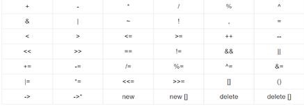

<h1 align="center"><strong>Object Oriented Programming</strong></h1>

# Introduction
OOPs refers to the language that uses concept of classes and objects in programming. The main objective of OOPs is to implement real-world entities such as **polymorphism, inheritance, encapsulation, abstraction** etc.

# Access Modifiers
Access Modifiers in a class are uses to assign access to the class members. It sets some restrictions on the class members not to get directly accessed by the outside functions.

There are three types of access modifiers available in C++:
* `Public:` All the class members with public modifier can be accessed from anywhere (inside and outside the class).
* `Private:` All the class members with private modifier can only be accessed by the member function inside the class.
* `Protected:` The access level of a protected modifier is within the class and outside the class through child class.

**Note: Default Access Modifier is `Private`.**

# Classes and Objects

### Class
A class is a logical entity that is used to define a new data type. Class is a template for an object.

Syntax to define a class:
```cpp
class class_name {
    // class body
};
```

**Note: Class just defines the structure of object. No memory or storage is allocated for the class. But size of a empty class is 1byte (just to identify it).**  


### Object
The object is an entity that has a state and behavior. To access the members defined inside the class, we need to create the object of that class.

Syntax to create an object:
```cpp
Classname objectname;
```

Syntax to create an object dynamically:
```cpp
Classname *objectname = new Classname();
```

### Getters and Setters
Getters are those functions that allow us to access the data members of the object.  
Setters are those functions that allow us to change the data members of the object. These are also called mutator functions.

Example:
```cpp
#include <bits/stdc++.h>
using namespace std;

class Student {
    string name;
    int marks;

  public:
    int getName() { return name; }
    int getMarks() { return marks; }

    void setName(string name) { this->name = name; }
    void setMarks(int marks) { this->marks = marks; }

};
```

### Defining Member functions outside the class

```cpp
#include <bits/stdc++.h>
using namespace std;

class Student {
    int rollno, marks;

  public:
    int getRollno();
    int getMarks();

};

int Student::getRollno() { return rollno; }
int Student::getMarks() { return marks; }
```

`:: is scope resolution operator.`

# Constructors
A constructor is a special type of member function that is called automatically when an object is created.

```cpp
class D {
  public:
    // constructor
    D(){
        // code
    }
};
```

The constructor:
* has same name as the class
* does not have a return type
* is **public**

Types of constructor:
* `Default constructor:` The default constructor is the constructor the doesn't take any argument.
    ```cpp
    Class_name()
    ```
* `Parameterized constructor:` Constructor with parameters
    ```cpp
    Class_name(parameters)
    ```
* `Copy constructor:` A copy constructor is a member function that initializes an object using another object of the same class.
    ```cpp
    Class_name(const Class_name &old_object)
    ```
    **We must have to pass object by reference in copy constructor else it will again call copy constructor and got stuck in infinite loop**

### Constructor Overloading
In C++, we can have more than one constructor in a class with same name, as long as each has a different list of arguments.

# Destructor
A destructor is a special member function that works just opposite to the constructor, unlike constructors that are used for initializing an object, destructors destroy the object.

```cpp
~class_name(){
    // code
}
```

Destructor rules:
* The name should begin with a tilde sign (~) and must match the class name.
* There can't be more than one destructor in a class.
* Unlike constructor that can have parameters, destructors do not allow any parameters.
* They don't have any return type, just like constructors.

**Note: Destructor automatically got called for statically allocated, for dynamic allocation we've to manually call the destructor.**

# this Pointer
`this` pointer holds the current object's address.

# Shallow and Deep Copy

### Shallow Copy
An object is created by copying all of the member field values. Here, the pointer will be copied but not the memory it points to. It means that the original object and the created object will npw point to same memory address.

### Deep Copy
An object is created by copying all the fields, and it also alocates similar memory resources with the same value to the object. To perform deep copy, we need to explicitly define the copy constructor.

# Encapsulation
The process of grouping data members and corresponding methods into a single unit.

Advantages of Encapsulation:
* It is a way to achieve data hiding 
* we can hide the data's internal information
* we can make the class read-only

# Inheritance
Inheritance is the process of inheriting the properties and behavior of an existing class into a new class.

C++ Inheritance syntax:

```cpp
class parent_class {
    // Body of parent class
};

class child_class: access_modifier parent_class {
    // Body of child class
};
```

| Base Class member Access Specifier | Public | Protected | Private |
| ---------------------------------- | ------ | --------- | ------- |
| Public | Public | Protected | Private |
| Protected | Protected | Protected | Private |
| Private | Private | Private | Private |

Types of Inheritance:
* `Single Inheritance:` In single inheritance, one class can extend the functionality of another class. In single inheritance, there is only one parent class and one child class.  

* `Multilevel Inheritance:` When a class inherits from a derived class, and the derived class becomes the base class of the new class, it is called multilevel inheritance. In multilevel inheritance, there is more than one level.  

* `Multiple Inheritance:` In multiple inheritance, a class can inherit more than one class. This means that in this type of inheritance, a single child class can have multiple parent classes.  

* `Hierarchical Inheritance:` In hierarchical inheritance, one class serves as a base class for more than one derived class.  

* `Hybrid Inheritance:` Hybrid inheritance is a combination of more than one type of inheritance. For example, A child and parent class relationship that follows multiple and hierarchical inheritances can be called hybrid inheritance.  


### Inheritance Ambiguity
There may be a possibility that a class may inherit member functions with same name from two or more base classes, and the derived class may not have functions with the same name as those of its base classes. If the derived class needs to access one of the same-named member functions of the base classes, it results in ambiguity as it is not clear to the compiler which base's class member function should be invoked.

```cpp
#include <bits/stdc++.h>
using namespace std;

class A {
  public:
    void abc(){
        cout << "Class A";
    }
};

class B {
  public:
    void abc(){
        cout << "Class B";
    }
};

class C: public A, public B {
  public:
};

int main(){
    C obj;
    obj.abc();
}

// Output:
// error: request for member 'abc' is ambiguous
```

The ambiguity can be resolved by using the `scope resolution operator (::)` by specifying the class in which the member function lies

```cpp
#include <bits/stdc++.h>
using namespace std;

class A {
  public:
    void abc(){
        cout << "Class A";
    }
};

class B {
  public:
    void abc(){
        cout << "Class B";
    }
};

class C: public A, public B {
  public:
};

int main(){
    C obj;
    obj.A::abc();
}

// Output:
// Class A
```

# Polymorphism
Existing in multiple forms

Types of polymorphism:
* `Compile-time Polymorphism:` Compile time polymorphism is also known as static polymorphism. This type of polymorphism can be achieved through `function overloading` or `operator overloading`.
  * `Function overloading:` When there are multiple functionsin a class with the same name but different parameters, these functions are overloaded.
  **Note: Function overloading is not possible by changing return type.**
  * `Operator overloading:` For example, we can make the operator (‘+’) for the string class to concatenate two strings. We know that this is the addition operator whose task is to add two operands.
  Lists of operators that can be overloaded in C++
  
  Lists of operators that can not be overloaded in C++
  
    ```cpp
    #include <bits/stdc++.h>
    using namespace std;

    class Complex {
      private:
        int real, img;
      public:
        Complex(int real = 0, int img = 0){
            this->real = real;
            this->img = img;
        }

        Complex operator + (Complex const &b) {
            Complex a;
            a.real = real + b.real;
            a.img = img + b.img;
            return a;
        }

        void print(){
            cout << real << " + i" << img << endl;
        }
    };

    int main(){
        Complex c1(10, 5), c2(2, 4);
        Complex c3 = c1 + c2; 
        c3.print();
    }

    // Output: 12 + i9
    ```
* `Run-time Polymorphism:` Runtime polymorphism is also known as dynamic polymorphism. Method overriding is a way to implement runtime polymorphism. Method overriding is a feature that allows yout to redefine the parent class method in the child class.
    ```cpp
    #include <bits/stdc++.h>
    using namespace std;

    class Parent {
      public:
        void show(){
            cout << "Inside Parent Class" << endl;
        }
    };

    class Child {
      public:
        void show(){
            cout << "Inside Child Class" << endl;
        }
    };

    int main(){
        Child child;
        child.show();
    }

    // Output: Inside Child Class
    ```

# Abstraction
Abstraction means displaying only essential information and hiding the details.

# Interfaces
An interface describes the behavior of a C++ class without committing to a paritcular implementation of that class.

The C++ interfaces are implemented using abstract classes.

A class is made abstract by declaring at least one of its functions as pure virtual functions.

### Virtual Functions
A Pure Virtual Function is a function where we only declare the function but not the function definition. The implementation for pure virtual methods is done at the derived class by method/function overriding. A function is said to be a pure virtual function if it is defined in the class as follows:

```cpp
virtual datatype functionName(param1,param2,...) = 0;
```

### Abstract Class
An abstract class is a class that is specially designed to be used as a base class. Abstract class must have at least one pure virtual function. It may have variables and normal functions. The derived classes of an abstract class must implement all the pure virtual functions of their base class or else they too become abstract.

`We can create a pointer to the instance of the derived class with a reference of a base abstract class.`

```cpp
// C++ program to implement
// Interface
#include <iostream>
#include <string>
using namespace std;

// Interface(Abstract class
// with pure virtual function)
class GFG
{
public:
	virtual string returnString() = 0;
};

class child : public GFG
{
public:
	string returnString()
	{
	return "GeeksforGeeks";
	}
};

// Driver code
int main()
{
	child childObj;
	GFG* ptr;
	ptr = &childObj;
	cout << ptr->returnString();
	return 0;
}

```

# Friend Function
A class's friend function is defined outside that class's scope, but is has the right to access all private and protected members of the class. Even though the prototypes for friend functions appear in the class definition, friend functions are not member functions

Syntax:
```cpp
class class_name {
    friend data_type function_name(argument);
};
```

Example:
```cpp
#include <bits/stdc++.h>
using namespace std;

class Rectangle {
  private:
    int length;
  public:
    Rectangle(){
        length = 10;
    }
    friend int printLength(Rectangle);
};

int printLength(Rectangle b){
    b.length += 10;
    return b.length;
}

int main(){
    Rectangle b;
    cout << printLength(b) << endl;
    return 0;
}

// Output: 20
```

Characteristics of friend function:
* can be declared in the private or public section of the class
* can be called as a normal function without using the object
* is not in the scope of the class, of which it is a friend